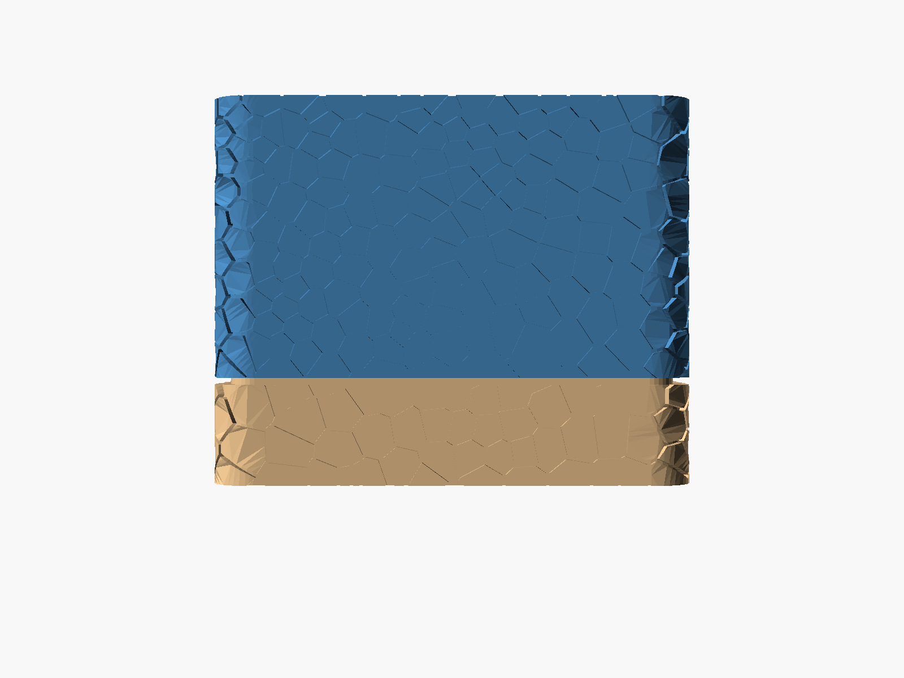

# Parametric MTG EDH deck box

A 3D-printable deck box for Magic: The Gathering EDH/Commander decks. Sized for sleeved cards lying flat, ~200 card capacity, with a Voronoi-scale texture and a two-bump snap-fit lid.



## Features

- **Sleeved-card cavity** — sized by default for 68.3 × 91.3 mm sleeves, 80 mm deck stack (1.5 mm horizontal clearance per side, 1 mm vertical slack). All cavity dimensions are parametric.
- **Voronoi-scale walls** — each cell is a discrete protruding "scale" rather than a continuous bump field, so the smooth wall behind shows through the gaps and the part is paintable as two colors (smooth wall + scales).
- **Two-bump snap-fit** — bumps only on the long sides; release by pinching the short (unbumped) sides to bow the long sides outward.
- **Decorative top + bottom windows** — through-cut frames for visibility / weight / aesthetics.

## Build

Requires [OpenSCAD](https://openscad.org) snapshot/nightly (for the Manifold backend) and Python 3.10+.

```bash
brew install --cask openscad@snapshot          # macOS — use your package manager elsewhere
python -m venv .venv && source .venv/bin/activate
pip install -r requirements.txt
bash build.sh
```

`build.sh` regenerates the Voronoi scale data (`seam.scad`) from `seam.py`, then renders `base.stl`, `lid.stl`, and two preview PNGs. End-to-end: about 3 seconds.

## Customizing

Common parameters to tune in `deckbox.scad`:

| Param | Default | Effect |
|---|---|---|
| `CAV_W`, `CAV_D`, `CAV_H` | 94.3, 71.3, 81.0 | Cards cavity dimensions (mm). Resize for different sleeves or stack heights. |
| `H_TOL` | 0.3 | Lid-over-base horizontal slide-fit clearance per side. Loosen on tight printers, tighten on sloppy ones. Also reduces snap-fit bump engagement by the same amount. |
| `LOCK_BUMP_R` | 0.9 | Snap-fit bump protrusion. Effective engagement = `LOCK_BUMP_R − H_TOL`. Smaller = easier release, looser hold. |
| `WIDE_WALL_T`, `NARROW_WALL_T` | 3.92, 1.86 | Wall thicknesses for the base wide and narrow sections. |

If you change `CAV_W`, `CAV_D`, `CAV_H`, `WIDE_WALL_T`, `NARROW_WALL_T`, `FLOOR_T`, `CEILING_T`, `SEAM_Z`, or `VERTICAL_GAP`, mirror the same value into `seam.py` — the Voronoi geometry needs to align with the wall geometry.

In `seam.py`:

| Param | Default | Effect |
|---|---|---|
| `CELL_DENSITY` | 0.026 cells/mm² | Scale density. Higher = smaller, more numerous scales. |
| `SCALE_PROTRUSION` | 1.5 | How far each scale sticks out from the smooth wall (mm). |
| `SCALE_GAP` | 0.4 | Width of the smooth-wall "grout" between adjacent scales (mm). |
| `SCALE_OVERLAP` | 0.3 | How far each scale extends into the wall material (for clean union). |

## Printing

- **Material**: PLA or PETG. Both work; PETG snap-fit is slightly more forgiving.
- **Layer height**: 0.2 mm.
- **Orientation**: base open-side-up, lid open-cavity-up. Both parts have flat undersides — no supports needed.
- **Infill**: 15 – 20 % is plenty.
- **First layer**: nothing special; the protruding scales start above the build plate.

To paint the dual-color effect, drybrush the protruding scale tops in a contrasting color after the part is printed in a single material. The 0.4 mm "grout" gaps stay the base color.

## How it works

- `deckbox.scad` builds the box, lid, cavity, windows, and snap-fit bumps as plain OpenSCAD primitives.
- `seam.py` runs a Voronoi tessellation in arc-length-along-perimeter × height space, then maps each cell back onto the curved outer wall and emits each one as a `polyhedron(...)` with explicit vertices and faces — Manifold handles ~600 of these in well under a second.
- `seam.scad` is the generated include with two modules: `base_teeth()` and `lid_teeth()`. `deckbox.scad` unions them into the respective parts.

The split between Python and OpenSCAD is deliberate: Voronoi and polygon offset are easy in Python (scipy + shapely) and miserable in OpenSCAD, while CSG of the box body is the other way around.

See [`CLAUDE.md`](CLAUDE.md) for the gotcha list — useful if you (or an AI assistant) start modifying the scale geometry.

## License

MIT. See [LICENSE](LICENSE).
